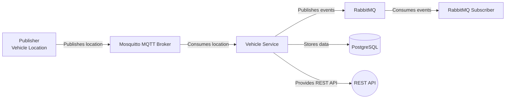

# TransJakarta Vehicle Location Tracking System

This project is a distributed system for tracking TransJakarta vehicle locations using MQTT, RabbitMQ, and a REST service.

## System Architecture



## Components

1. **Mosquitto MQTT Broker**
   - Handles real-time vehicle location updates
   - Runs in Docker container
   - Port: 1883

2. **Vehicle Location Publisher**
   - Go application that publishes vehicle location data
   - Connects to MQTT broker
   - Located in `publishVehicleLocation/`

3. **Vehicle Service**
   - Main service with REST API and message consumers
   - Consumes MQTT messages
   - Publishes events to RabbitMQ
   - Handles database operations
   - Located in `vehicleSvc/`

4. **RabbitMQ Subscriber**
   - Consumes messages from RabbitMQ
   - Standalone Go application
   - Located in `rabbitMQSubscriber/`

## Prerequisites

- Docker and Docker Compose
- Go 1.21 or later
- Make (for vehicleSvc commands)

## Setup Instructions

The project uses Docker Compose for orchestrating all the main services including database migrations. The Vehicle Location Publisher and RabbitMQ Subscriber are run separately.

1. **Start the Infrastructure Services**

```bash
cd vehicleSvc
docker-compose up -d
```

This will start all services including:
- PostgreSQL (port 5432)
- RabbitMQ (ports 5672, 15672)
- Mosquitto (port 1883)
- Database Migrations (automatic)
- Vehicle Service REST API (port 8000)
- Vehicle Service Consumer

4. **Run the Vehicle Location Publisher**

```bash
cd publishVehicleLocation
go run main.go
```

5. **Run the RabbitMQ Subscriber**

```bash
cd rabbitMQSubscriber
go run main.go
```

## Service Configuration

### Database (PostgreSQL)
- Host: localhost:5432
- Database: transjkt
- Username: admin
- Password: admin

### RabbitMQ
- Host: localhost:5672
- Management UI: http://localhost:15672
- Username: admin
- Password: admin123

### Mosquitto MQTT
- Host: localhost:1883
- No authentication required (default configuration)

## Database Schema

### Vehicles Table
```sql
CREATE TABLE vehicles(
    vehicle_id varchar(100) not null,
    vehicle_type varchar(100) not null,
    vehicle_code varchar(100) not null
);
```

### Vehicle Locations Table
```sql
CREATE TABLE vehicle_locations(
    vehicle_id varchar(100) not null,
    latitude double precision not null,
    longitude double precision not null,
    timestamp int not null
);
```

## API Documentation

The Vehicle Service provides REST APIs for:
- Vehicle management
- Location tracking
- Historical location data

Detailed API documentation is available at the service endpoints.

## Development

### Makefile Commands

The Vehicle Service (`vehicleSvc/`) includes several helpful make commands:

```bash
# Database Migration Commands
make migrate-up      # Run database migrations up
make migrate-down    # Rollback database migrations
make migrate-fresh   # Rollback all migrations and migrate up again
make migration name=migration_name  # Create new migration files

# Development Commands
make run            # Run the REST API service
make docs           # Generate Swagger documentation (requires swag)
make test           # Run tests with coverage report
```

### Development Guide

To modify or extend the system:

1. **Vehicle Service**
   - Uses Clean Architecture pattern
   - Located in `vehicleSvc/`
   - Contains database migrations in `database/migration/`
   - Use `make migration name=your_migration_name` to create new migrations

2. **Location Publisher**
   - Simple Go application for publishing location updates
   - Modify `publishVehicleLocation/main.go` to change publishing behavior

3. **RabbitMQ Subscriber**
   - Consumer application for RabbitMQ events
   - Modify `rabbitMQSubscriber/main.go` to handle different event types

## Monitoring

- RabbitMQ Management UI: http://localhost:15672
- Database can be accessed using any PostgreSQL client
- MQTT messages can be monitored using MQTT client tools

## Troubleshooting

1. If services fail to start, check:
   - Port availability (5432, 5672, 15672, 1883)
   - Docker daemon status
   - Service logs using `docker-compose logs`

2. For database issues:
   - Ensure migrations are run
   - Check database connectivity
   - Verify credentials

3. For messaging issues:
   - Verify MQTT broker is running
   - Check RabbitMQ management console
   - Verify service connections